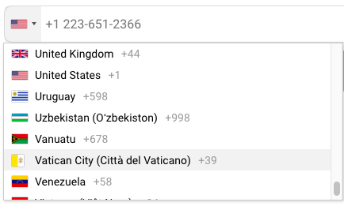

# ion-intl-tel-input

Ionic library to enter and confirm international telephone numbers. It adds a drop-down flag for any input, user's country discovery, displays a relevant placeholder, and provides formatting / validation methods.



## Installation

This library depends on `BsDropdownModule` from `ngx-bootstrap/dropdown`.
To install this library, run:

```bash
$ npm install google-libphonenumber --save
$ npm install jquery --save
$ npm install --save ng-click-outside
$ npm install ngx-bootstrap --save
```
Then import `BsDropdownModule` and `ClickOutsideModule` at `AppModule`. (more details see : http://valor-software.com/ngx-bootstrap/#/dropdowns and https://www.npmjs.com/package/ng-click-outside)

```typescript
import { BsDropdownModule } from 'ngx-bootstrap/dropdown';
import { ClickOutsideModule } from 'ng-click-outside';

@NgModule({
  ...
  imports: [
      ...
    ClickOutsideModule,
    BsDropdownModule.forRoot()
      ...
  ],
  ...
})
export class AppModule { }
```
## Consuming library

Copy the code into your project:
Copy folder img into assest folder
Copy file intl-tel-input.css into theme folder and import file intl-tel-input.css into file your file css.

```xml
home-page {
     @import '../theme/intl-tel-input';
}

```
You can also import files app.scss

```xml
    @import '../theme/intl-tel-input';
```
 So, You neend

Once library is imported, you can use components in your Ionic application:

```xml

<h1>
  {{phone_number}}
</h1>
<ion-intl-tel-input [(value)]="phoneNumber"></ion-intl-tel-input>
```

### Parameters

| Input | Description |
| ------ | ------ |
| value | Phone number |
